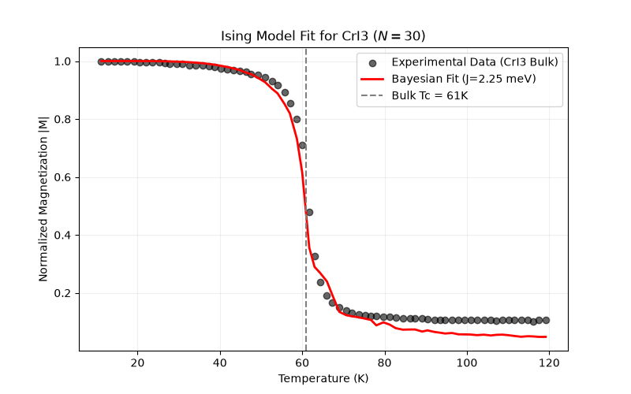

# Extracting Exchange Coupling via Bayesian Inference

## Overview
This repository contains a high-performance computational pipeline designed to estimate the effective exchange coupling parameters in 2D magnetic materials. By coupling Monte Carlo forward-modeling with a Bayesian inference framework, this tool successfully extracted an effective exchange coupling of **$J = 2.25$ meV** for bulk CrI3, perfectly aligning with its experimental critical temperature of 61K.

## Key Features
* **High-Performance Simulations (35s Execution):** Implements the Metropolis algorithm for a 2D square-lattice Ising model. Uses **Numba** for JIT compilation and **Joblib** for parallelization, reducing a full 15-point Bayesian grid search to under 40 seconds on standard hardware.
* **Bayesian Inference Framework:** Extracts posterior distributions of the coupling parameter ($J$) by comparing simulated magnetization curves against experimental data.
* **Automated Data Digitization:** Includes a custom computer-vision utility script (`PIL` and `Pandas`) to extract, clean, and bin experimental magnetization data directly from literature plots.
* **Synthetic Data Validation:** Features a module to generate simulated, noisy datasets (utilizing cold-start initializations to avoid topological domain trapping) to validate the accuracy of the inference pipeline.

## Tech Stack
* **Language:** Python 3.x
* **Core Libraries:** NumPy, Pandas, Matplotlib
* **Performance/Optimization:** Numba, Joblib
* **Image Processing:** Pillow (PIL)

## Quick Start
1. Clone the repository.
2. Install dependencies: `pip install -r requirements.txt`
3. Run `python Image_Data_extractor.py` to generate the CSV datasets from the literature image.
4. Run `python BI_modded.py` to execute the Monte Carlo simulation, perform the Bayesian inference, and view the fit.
